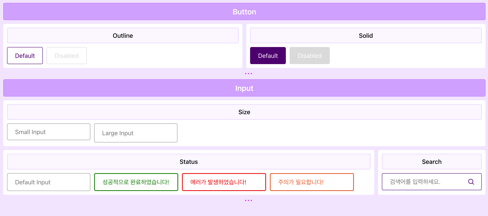

# 🤝 Atomic Components

## 수행 조건

테스트는 다음 조건을 충족해야 합니다.

- [ ] 모두가 접근 가능
- [ ] 의미있는 구조 설계
- [ ] 체계적인 표현 설계
- [ ] 원할한 상호작용 설계

## 🚲 작업 및 스타일링

- Layout Page

  - App.js
  - Container.js
  - Section.js
  - Group.js

- Components

  - Input.js
  - InputGroup.js
  - Button.js
  - ButtonGroup.js

## 🎥 스크린샷

